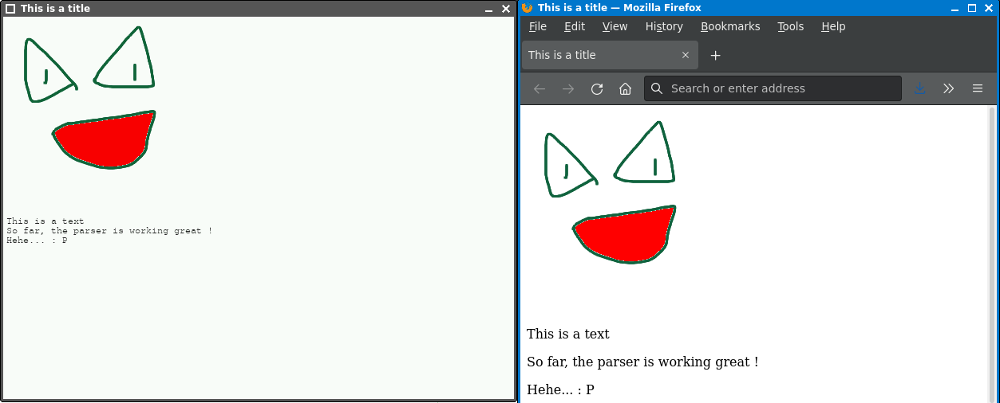

Toy Browser OpenDingux
-----------------------

This is a simple HTML renderer that will target OpenDingux devices.

My goal is to have something that is easily portable (we use SDL 1.2 for now), can process some old HTML files with some styling eventually and maybe use it to port some simple HTML5 games.

Prior to that, i had port Webkit to OpenDingux with the help of Qt5 and the related QtWebkit project.
However, it was a huge dependency, the file size was insane, the compiling issues forced me to disable the JIT and it ended up not running very fast...

It also did not support sound very nicely, as it relies on gstreamer for that purpose.
Unfortunately, it was more trouble than worth it but i still provided a basic version for people to enjoy.

Soooo yeah, porting a web browser to something that just has a simple framebuffer was going to be a challenge,
not to mention that most of them don't really have embedded hardware in mind :/

(Much less a decent codebase for that matter, the least worst being Webkit)

Here's my wish list for my toy web browser :

- Support the Canvas API for games

As long as Javascript support is added, this should be mostly straight forward (at least for most of the APIs).

- Support Javascript through Duktape or QuickJS

Here's a nice example that uses QuickJS :
https://github.com/juju2143/squidge

Another one that uses Duktape and has the foundations for the Canvas API along with Javascript :
https://github.com/juju2143/tiewrap

If i ever implement Javascript support, it would be together with the Canvas API so we can run some basic HTML5 games.

- Support some CSS styling

Mostly for scaling up Canvases and basic styling like setting a color to the text, background...
I probably would have to implement some support for classes and IDs as well.

- Support links for text

A necesarry component for allowing at least some interactivity, as it was done back in the early to middle 90s.

- Render correctly all of the test pages

Acid1 will be the hardest due to some CSS tricks...
I don't think i'll go as far but if i could at least support some styling, it would be nice.

- Add libcurl to support http and https pages

This will probably be done last.
